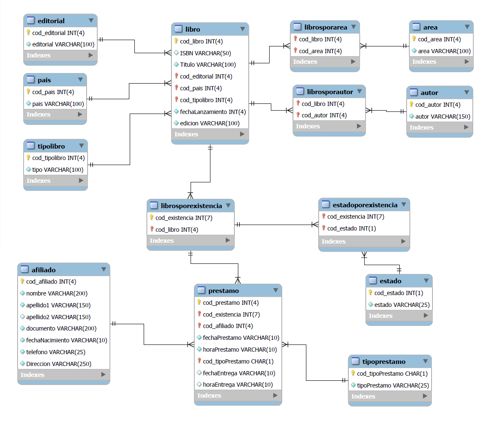
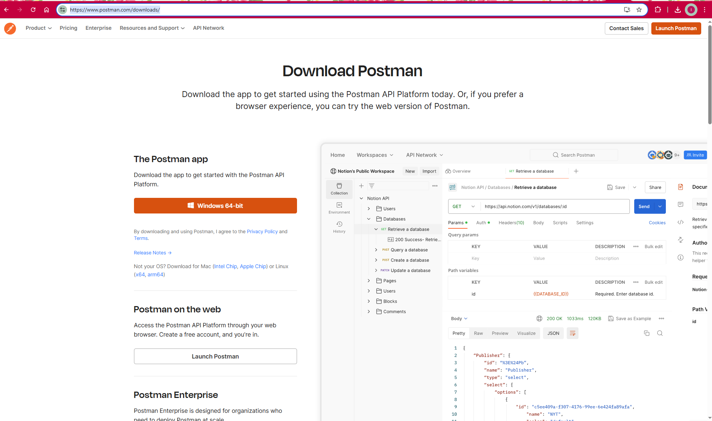
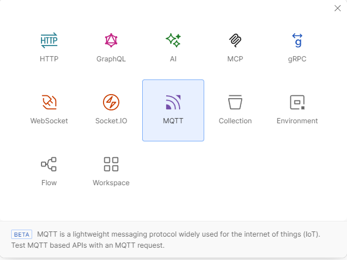
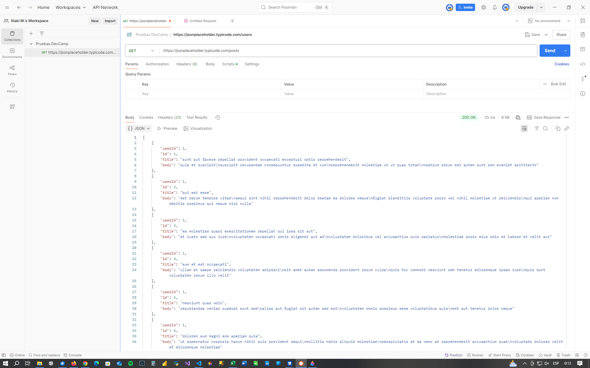

# Checkpoint nº 6: teoría

## 1. ¿Para qué usamos Clases en Python?
Antes de responder a esta pregunta, voy a poner un poco de contexto, explicando qué es un paradigma de programación, concepto básico que se aplica a todos los lenguajes de programación y que es necesario para responder a la pregunta.  
Los **paradigmas de programación** son enfoques o estilos fundamentales para organizar y estructurar cualquier código de programación. Cada paradigma ofrece una forma distinta de pensar y resolver problemas en el ámbito del desarrollo de software. Existen muchos paradigmas, pero nos vamos a centrar en el **paradigma orientado a objetos**, que es el que nos ocupa.
**POO (Programación Orientada a Objetos)** es un paradigma de programación que organiza el código en clases y objetos, facilitando la reutilización, modularidad y mantenibilidad del software. En este paradigma, todo es un objeto (enteros, strings, listas, funciones, etc.) Además, puedes crear tus propias estructuras de datos y comportamientos personalizados, que también serán objetos. La **Programación Orientada a Objetos (POO)** es uno de los paradigmas más utilizados en el desarrollo de software debido a su capacidad para modelar problemas del mundo real de manera intuitiva, ya que creamos objetos que existen en el mundo real (ya sean objetos físicos o conceptuales) con todas las características (atributos) y funcionalidades (métodos) necesarios para cumplir el objetivo de programación deseado. De alguna manera, recreamos el mundo real con su comportamiento específico en nuestra aplicación Python. Python es un lenguaje de programación multiparadigma: eso significa que podemos programar en Python usando diferentes paradigmas. En el caso de Python, podemos usar el paradigma funcional/modular y el **paradigma orientado a objetos**. 
Cada objeto combina:
- Datos (atributos o propiedades).
- Comportamientos (métodos o funciones).  

### Componentes clave
#### 1. Clase
Es el **molde** que nos sirve para construir los objetos del paradigma orientado a objetos. La clase se define por los atributos y métodos propios a cualquier objeto de esa clase.
#### 2. Objeto
Instancia concreta de una clase. Estos son los objetos reales que se crean en el espacio de objetos y tiene existencia real en el espacio de memoria de la aplicación.
#### 3. Atributo
Variables que almacenan datos del objeto (ej: color, precio).
#### 4. Método
Funciones asociadas al objeto (ej: calcularTotal()).
#### 5. Constructor
Método especial que inicializa el objeto al crearse. Este método es el que hace que cada instancia u objeto sea único en el espacio de objetos.

**Ejemplo**
```python
class Coche:                               # Esta es la clase, molde que usamos para construir objetos 'coche'
    
    def __init__(self, marca, modelo):     # Método constructor
        self.marca = marca                 # Atributo
        self.modelo = modelo               # Atributo
        self.velocidad = 0                 # Atributo

    def acelerar(self, incremento):        # Método
        self.velocidad += incremento

# Crear objeto
mi_coche = Coche("Volkswagen", "Golf")     #Objeto 'coche' con unas ciertas características
tu_coche = Coche("Ford", "Mondeo")         #Objeto 'coche' con otras características diferentes
```
En este ejemplo, a partir de la clase **Coche**, hemos creado 2 coches distintos, cada uno con sus características (marca y modelo) particulares.

### Características fundamentales de la programación orientada a objetos

#### 1. Abstracción
Se modelan solo las características esenciales de un objeto para el objetivo de desarrollo definido, ignorando detalles irrelevantes.
Ejemplo: un objeto *Auto* puede abstraerse con atributos como marca, modelo y métodos como arrancar().  
**Ejemplo**:
```python
class Auto:
    def __init__(self, marca, modelo):
        self.marca = marca          # Atributo
        self.modelo = modelo        # Atributo
    
    def arrancar(self):         
        print('Coche arrancado')    # Método  
```

#### 2. Encapsulación  
Ocultar los detalles internos de un objeto y exponer solo lo necesario (mediante modificadores de acceso: public, private, protected).  
```python
class Auto:
    def __init__(self, marca, modelo):
        self._marca = marca          # Atributo protegido, marcado con '_'
        self._modelo = modelo        # Atributo protegido, marcado con '_'
    
    def arrancar(self):         
        print('Coche arrancado')    # Método  
```  
El underscore (_) indica que ese atributo no debe ser accedido desde fuera del objeto, protegiando así su modificación indeseada.


#### 3. Herencia  
Permite que una clase (subclase) herede atributos y métodos de otra clase (superclase), promoviendo la reutilización de código. Esto es una herramienta poderosísima ya que podemos definir clases muy generales, y mediante la herencia, crear clases más concretas, definiendo y concretando sus propiedades y métodos.  

**Ejemplo**
```python
class Animal:
    def respirar(self):
        print("Respirando...")

class Perro(Animal):  # Perro hereda de Animal el método 'respirar'
    def ladrar(self): # Añadimos este atributo, específico de ese tipo de animal concreto
        print("¡Guau!")
```
#### 4. Polimorfismo
Esta característica nos permite hacer que un mismo método tenga diferentes implementaciones dependiendo de la clase.  

**Ejemplo**  
```python
class Animal:
    def se_comunica(self):
        pass

class Perro(Animal):  # Hereda de Animal
    def se_comunica(self):
        print("¡Guau!")

class Gato(Animal):  # Hereda de Animal
    def se_comunica(self):
        print("¡Miau!")
```
Hemos implementado el método *se_comunica* de forma diferente para cada uno de los objetos tipo *Animal*. Esta característica da una enorme flexibilidad a cualquier lenguaje orientado a objetos.

### Ventajas de la POO  
- Reutilización de código a través de la herencia.
- Modularidad, mantenibilidad  y seguridad a través de la encapsulación.
- Flexibilidad a través del polimorfismo.
- Modelado intuitivo de problemas reales mediante objetos reconocibles por cualquiera.

### Lenguajes que usan POO

Java, C++, Python, C#, Ruby, JavaScript, PHP, Swift...

### Casos de uso más adecuados para usar POO
- Sistemas con entidades complejas (ej: videojuegos, apps bancarias).  
- Cuando se requiere escalabilidad y organización.  
- Proyectos colaborativos (gracias a la modularidad).

## 2. ¿Qué método se ejecuta automáticamente cuando se crea una instancia de una clase?
Tal como he explicado en el punto anterior, en la **programación orientada objetos** todos los objetos que se crean lo hacen a partir de un molde, que es la **clase**. Cuando se instancia (crea) un objeto, se le asigna una dirección en memoria y un espacio donde se asignan los valores particulares que lo diferencian de los otros objetos creados a partir de la misma clase. Esos valores son los que usa el método *creador* (que es el que se ejecuta automáticamente al crear una instancia) para asignarlos al objeto. El método creador se llama siempre igual y su nombre es **\_\_init\_\_**.

### Características clave
- **Nombre especial**  
Siempre se llama **\_\_init\_\_**. Los nombres que comienzan y terminan con dos guiones bajos (dunders) tienen un significado especial en Python.
- **Constructor**  
Es el constructor de la clase. Define cómo se crea un objeto de esa clase.
- **Inicialización de atributos**  
Se utiliza para asignar valores iniciales a los atributos del objeto.
- **El primer argumento siempre es *self***  
Siempre recibe self como primer argumento, que es una referencia al objeto que se está creando. Este eargumento es el que lo hace único diferenciándolo del resto de los objetos. A través de self, puedes acceder y modificar los atributos del objeto.
- **Puede recibir otros argumentos**  
Además de self, puede recibir otros argumentos que se utilizan para inicializar los atributos con valores específicos. 

**Ejemplo**  
```python
class Coche:         
    
    def __init__(self, marca, modelo):  # Constructor
        self.marca = marca              # Atributo
        self.modelo = modelo            # Atributo
        self.velocidad = 0              # Atributo

    def acelerar(self, incremento):     # Método
        self.velocidad += incremento

# Crear objeto
mi_coche = Coche("Volkswagen", "Golf")   #Objeto 'coche' con unas ciertas características
print(f'Mi coche\n Marca: {mi_coche.marca}\n Modelo: {mi_coche.modelo}')

# Salida

# Mi coche
#  Marca: Volkswagen
#  Modelo: Golf
```
En este ejemplo. hemos creado un objeto de tipo *coche*. Al ejecutar la línea:
```python
mi_coche = Coche("Volkswagen", "Golf")
```
el intérprete Python crea un objeto en memoria y asigna a sus atributos *marca* y *modelo* los valores que hemos pasado al método constructor **\_\_init\_\_** ("Volkswagen" y "Golf", respectivamente)


## 3. ¿Cuáles son los tres verbos de API?
La verdad es que los métodos explicados en el curso son 4: GET, POST, PUT y DELETE, pero intentaré ajustarme a la pregunta.
Para contextualizar, explicaré primero qué es una API.  
Una **API (Application Programming Interface)** es un conjunto de reglas, protocolos y herramientas que permiten que diferentes sistemas o componentes de software se comuniquen entre sí. Actúa como un intermediario que facilita la interacción entre aplicaciones, sin necesidad de que los desarrolladores conozcan los detalles internos de cada sistema. De esta mnanera, podemos acceder a un recurso (archivo csv, json, html, ...) que ofrezca un servidor, usando un protocolo estandar, universal para cualquier servidor/servicio. Así, podemos desarrollar una aplicación que acceda a datos que otras aplicaciones ofrezcan, sin preocuparnos de cómo ese servidor remoto haya implementado ese recurso: para nosotros es una *caja negra* con la que interactuamos *lenguaje estándar (protocolo de comunicación)* predefinido y que responde adecuadamente a nuestra interacción, ya sea para obtener información o para enviársela.

### Tipos comunes de APIs  
1. **Web APIs**. Accesibles via HTTP/HTTPS. Ejemplo: Twitter API, Google Maps API    
2. **SOAP**. Protocolo basado en XML. Ejemplo: sistemas empresariales          
3. **REST**. Arquitectura basada en HTTP. Ejemplo: API de GitHub                   
4. **GraphQL**. Permite consultas específicas.Ejemplo: API de Shopify                  
5. **Bibliotecas**. APIs para lenguajes de programación. Ejemplo: math en Python       

### Componentes clave de una API
1. **Endpoint** URL única que identifica un recurso (ej: api.com/users). Es la 'dirección' donde se encuentra ese recurso.
1. **Métodos/Verbos HTTP**. Acciones (GET, POST, PUT, DELETE) Son las acciones que podemos realizar: obtener (GET), enviar (POST), actualiza (PUT) o borrar (DELETE) contra el recurso remoto. Estos verbos son específicos de una API REST. Otro tipo de APIs pueden tener otro tipo de sistema de interacción con la API.
1. **Request (Solicitud)**. Datos enviados al servidor
1. **Response (Respuesta)**. Datos devueltos por el servidor
1. **Formato de datos**. Usualmente JSON o XML.

           

### Cómo funciona el flujo API
1. Cliente hace una solicitud (request)
1. API valida y procesa la solicitud
1. Servidor ejecuta la operación requerida
1. API devuelve una respuesta (response) al cliente

### Verbos HTTP
Los verbos HTTP (también llamados métodos HTTP) son fundamentales en el diseño de APIs RESTful, ya que definen la acción que se realizará sobre un recurso.  
Los tres verbos principales (o métodos HTTP) utilizados en una API son:

1. **GET**  
Se utiliza para solicitar datos de un recurso específico. Es una operación de solo lectura y no debe modificar el servidor.
1. **POST**  
Se utiliza para enviar datos al servidor para crear un nuevo recurso.
1. **PUT**  
Se utiliza para enviar datos para actualizar o reemplazar un recurso existente.

En Python, la biblioteca **requests** es la que nos permite gestionar el entorno API REST. Para ello debemos instalarla en nuestro entorno con el comando

```
pip install requests
```
y para usarlo en nuestra aplicación debemos importarlo
```python
import requests
```
Un ejemplo de uso, con una solicitud **get**.

```python
import requests
import pprint

r = requests.get('https://jsonplaceholder.typicode.com/posts')   # Obtenemos el recurso con 'GET'
pprint.pprint(r.json()[1]['body'])   # Mostramos parte de la información recibida

# Salida

#('est rerum tempore vitae\n'
# 'sequi sint nihil reprehenderit dolor beatae ea dolores neque\n'       
# 'fugiat blanditiis voluptate porro vel nihil molestiae ut reiciendis\n'
# 'qui aperiam non debitis possimus qui neque nisi nulla')

```
En esta código solicitamos a la URL *https://jsonplaceholder.typicode.com/* el recurso */posts* mediante el verbo **get**. El servidor nos devuelve 500 post en formato JSON. Este se trasforma mediante el método *json()* en un objeto python (una lista de dicccionarios en este caso) y mediante *pprint*, mostramos en pantalla el valor *'body'* del elemento de la lista con index = 1. Hemos accedido a un recurso remoto (la dirección https), hemos obtenido un recurso que ese servidor ofrecía y a partir de ahí podremos usarlo como queramos. Obviamente, previamente debíamos tener información de la existencia de ese recurso. En este caso es un recurso de utilización libre (sin necesidad de autentificación), pero en muchos otros casos necesitaremos de algún mecanismo de autentificación para acceder a él. Que en muchas ocasiones es previo pago de algún tipo de cuota.


## 4. ¿Es MongoDB una base de datos SQL o NoSQL?
La base de datos MongoDB es una base de datos NoSQL. Vamos a ver cuales son las diferencias entre unas y otras.  
### SQL (Bases de Datos Relacionales)
1. **Estructura**. Datos organizados en tablas con filas y columnas. Se define un esquema fijo muy rígido, lo que les resta flexibilidad. El cambio en su estructura es complejo y delicado. Es, por tanto, muy importante definir *a priori* una estructura correcta (schema) que es el que va a determinar el comportamiento de la base de datos.  
Un ejemplo de un esquema de una base de datos es el siguiente (cada rectángulo del dibujo es una tabla con sus propias filas y columnas)
<div align="center">
    
</div>

2. **Lenguaje de consultas**  
Utilizan SQL (Structured Query Language) para definir y manipular los datos. Este es un tipo de lenguaje de paradigma imperativo en el que expresamos lo que queremos obtener y el motor de base de datos se encarga de cumplir con la tarea. Aunque puede haber particularidades para cada motor de base de datos, de forma general emplean el mismo lenguaje base. Esto facilita el aprendizaje de nuevas bases de datos de esta familia.  

    **Ejemplo consulta SQL**
```sql
CREATE TABLE users (
    id INT PRIMARY KEY,
    name VARCHAR(100),
    email VARCHAR(100) UNIQUE
);
```
3. **Escalabilidad**  
 Escalado vertical (aumentar la capacidad de un solo servidor). Si la base de datos crece mucho al aumentar el nº de registros, necesitaremos aumentar los recursos (RAM, CPU, disco duro,...) asignados a la máquina donde resida la base de datos. Esto puede resultar en importantes incrementos de costos de operación.
1. **Consistencia**  
ACID (Atomicidad, Consistencia, Aislamiento, Durabilidad) para garantizar la integridad de los datos. Los resultados obtenidos de las consultas a estas bases de datos son fiables y coherentes.  

**Ejemplos**. MySQL, MariaDB, PostgreSQL, Oracle, Microsoft SQL Server.

### NoSQL (acrónimo de Not Only SQL)
1. **Estructura**  
Pueden ser orientadas a documentos, clave-valor, grafos, etc. No requieren un esquema fijo, lo que las hace extraordinariamente flexibles. Eso tiene sus inconvenientes ya que al permitir estructuras flexibles, pueden caer en el caos si no se lleva una gestión cuidadosa: se dice que estas bases de datos 'tragan' con todo, en contra de lo que pasa con las SQL.  

Ejemplo de un  registro de base de datos **MongoDB**
```mongo
{
  "_id": "123",
  "name": "Ana",
  "email": "ana@example.com",
  "address": {
    "city": "Madrid"
  }
}
{
    "_id": "124",
  "name": "Juan",
  "surname": "Campano"
  "email": "juan@example.com",
  "address": {
    "street": "C/Olmo
    "number": 45
    "city": "Madrid"
  }
}
```
Vemos que en este caso la estructura de los 2 documentos (equivalente a los registros de una base de datos SQL) no es la misma: el 2º tiene pares clave-valor ("surname", "street", "number") que no aparecen en el primero. Esto sería imposible en una SQL.  

2. **Lenguaje**  
Varía según el tipo de base de datos: el lenguaje de consulta de MongoDB tiene una cierta similitud con el estandar SQL, pero el de una base de datos de grafos como Neo4j, es muy diferente. Eso hace que el salto de una a otra pueda requerir una curva de aprendizaje importante.
Veamos un ejemplo de consulta **find** (búsqueda de un documento) sobre el ejemplo del punto anterior.
```mongodb
db.collection.find({
  "name": "Ana",
  "address.city": "Madrid"
})

# Salida: devuelve el documento que coincide con las condiciones de la búsqueda
 {
  "_id": "123",
  "name": "Ana",
  "email": "ana@example.com",
  "address": {
    "city": "Madrid"
  }
}
```
3. **Escalabilidad**. Escalado horizontal (distribuir los datos en múltiples servidores). Están diseñadas para que la necesidad de crecimiento se realice de manera sencilla, añadiendo más máquinas que trabajan en cluster. Esto suele ser más económico que el crecimiento vertical de las bases de datos SQL.
1. **Consistencia**. Pueden sacrificar algo de consistencia en favor de la disponibilidad y rendimiento (modelo BASE: Basically Available, Soft state, Eventually consistent). Los datos que entregan puede que no sean del todo fiables, en resumidas cuentas.

**Ejemplos**. MongoDB, Cassandra, Redis, Neo4j.

En resumen: las bases de datos **SQL** tienen una estructura rígida, consistencia fuerte y escalado vertical. Adecuadas para aplicaciones que requieren transacciones ACID (debe ser muy fiables y coherentes) y relaciones complejas entre datos.
Las bases de datos **NoSQL** son flexibles, escalan horizontalmente y suelen tener mayor rendimiento. Adecuadas para aplicaciones con grandes volúmenes de datos, esquemas variables y requisitos de alta disponibilidad.

## 5. ¿Qué es una API?
Creo que ha sido suficientemente explicado en la pregunta 3, ya que para explicar claramente cuáles son los verbos API, he explicado previamente qué es y cómo funciona una API.

## 6. ¿Qué es Postman?
**Postman** es una aplicación de escritorio, y también web, que nos permite usar muchos (si no todos) los tipos de entorno API. Es una plataforma colaborativa para el desarrollo y testing de APIs (Application Programming Interfaces) que se ha convertido en estándar para desarrolladores y equipos de QA. 

Es un cliente HTTP gráfico que permite:
- Enviar peticiones a APIs (en el caso de API REST mediante GET, POST, PUT, etc.)
- Organizar y documentar llamadas API
- Automatizar pruebas
- Mockear servicios
- Monitorear APIs en producción  

Postman ofrece versiones gratuitas y de pago (con más funcionalidades colaborativas), aunque la versión gratuita es más que suficiente para la mayoría de desarrolladores individuales.  
Para instalar Postman para Windows debemos acceder al link  https://www.postman.com/downloads/  

<div align="center">
    
</div>    

Nos permite usar muchos tipos de entornos API, cada uno de ellos con sus particularidades (verbos, operación,...). Ya mencioné en el punto 3 algunos tipos comunes de entornos API que existen. En este curso se están usando APIs de tipo REST, pero hay más. Estos son los tipo de APIs que puede gestionar Postman (imagen de las opciones que ofrece al crear una nueva colección).

<div align="center">
    
</div>    
  

En nuestro caso hemos usado API de tipo HTTP, con los verbos GET, POST, PUT y DELETE.  
Veamos un ejemplo de uso: cómo se realiza una consulta GET (obtener recurso) al servidor *https://jsonplaceholder.typicode.com/* (es un servidor gratuito de pruebas) solicitando el recurso */posts*

<div align="center">
    
</div>  

Al hacer click en **Send**, la aplicación **Postman** ejecuta la petición al servidor y éste le devuelve el recurso asociado a ese *endpoint*, en este caso un archivo JSON con posts de pruebas. De esta manera, podemos probar endpoints que creemos nosotros, o ver qué recursos nos ofrecen endpoints creados por terceros, antes de integrarlos en nuestras aplicaciones usando la biblioteca **requests**. El flujo de trabajo típico con Postman es el siguiente:
- Diseñar endpoints
- Crear colección Postman
- Configurar environments
- Probar endpoints manualmente
- Escribir tests automatizados
- Generar documentación
- Compartir con el equipo  

En resumen, Postman es una aplicaión imprescindible para el testeo de *endpoints* de APIs propias o ajenas, usadas previamente a la integración final en aplicaciones, mediante bibliotecas como **requests**.


## 7. ¿Qué es el polimorfismo?
Polimorfismo es una característica fundamental de los lenguajes basados en el paradigma orientado a objetos. Esta característica permite, dada una clase con sus atributos y métodos, que una clase heredera de ella pueda redefinir alguno o todos sus métodos, adecuándolos a las especificades de esa clase. Esto nos permite una enorme flexibilidad a la hora de programar.

### Tipos de Polimorfismo en Python
1. **Polimorfismo por Herencia (Sobrescritura de métodos)**  
Cuando una clase hija redefine un método de la clase padre:
```python
class Animal:
    def se_comunica(self):
        pass

class Perro(Animal):  # Hereda de Animal
    def se_comunica(self):  # Sobreescribimos el método
        print("¡Guau!")

class Gato(Animal):  # Hereda de Animal
    def se_comunica(self):  # Sobreescribimos el método
        print("¡Miau!")


mi_perro = Perro()
print(mi_perro.se_comunica())
# Salida
# ¡Guau!

mi_gato = Gato()
print(mi_gato.se_comunica())
# Salida
# ¡Miau!
```
En este ejemplo, hemos definido una clase genérica (Animal) y 2 clases heredaderas (Perro y Gato) En ambas hemos redefinido el método **se_comunica**, adecuándolo a la especifidad del animal que representan ambas clases.  

2. **Polimorfismo por Duck Typing**  
Python usa el principio "Si camina como pato y suena como pato, entonces es un pato". No importa el tipo del objeto, sino que tenga los métodos necesarios:
```python
class Pajaro:
    def volar(self):
        print("El pájaro vuela")

class Avion:
    def volar(self):
        print("El avión despega")

# Función que usa polimorfismo
def hacer_volar(objeto):
    objeto.volar()

# Objetos completamente distintos
hacer_volar(Pajaro())  # Salida: El pájaro vuela
hacer_volar(Avion())   # Salida: El avión despega
```
En este ejemplo, hemos definido una función **(no un método de una clase, cuidado con esta diferencia)** que usa un objeto genérico como parámetro. El objeto que le pasemos debe tener esa característica común (volar), independientemente del objeto que sea (en este caso, tanto el pájaro como el avión vuelan)

## 8. ¿Qué es un método dunder?
Los métodos dunder (de 'double underscore', representados mediante '__'), también conocidos como métodos mágicos o especiales, son métodos que permiten a las clases definir comportamientos especiales en Python. Se llaman así porque están rodeados por doble guión bajo **( \_\_metodo\_\_ )**.
Sirven para implementar funcionalidades especiales (operadores, acceso a atributos, inicializar atributos etc.)

### Categorías Principales
1. **Creación y destrucción de objetos**
- \_\_new\_\_	Crea la instancia (antes que \_\_init\_\_) Lo ejecuta silenciosamente el interprete python (no lo hacemos nosotros) al ejecutar una sentencia del tipo
```python
obj = MiClase()
```
- \_\_init\_\_	Constructor (inicialización) Se define dentro de cada clase e inicializa los atributos del objeto. Si no se define se usa un \_\_init\_\_ por defecto vacío.
```python
class Coche:         
    
    def __init__(self, marca, modelo):  # Constructor
        self.marca = marca  # Atributo
        self.modelo = modelo   # Atributo
        self.velocidad = 0  # Atributo

# Crear objeto
mi_coche = Coche("Volkswagen", "Golf")   #Objeto 'coche' con unas ciertas características
```

Con la setencia "*mi_coche = Coche("Volkswagen", "Golf")*" después de \_\_new\_\_, se ejecuta el método \_\_init\_\_ definido dentro de la clase *Coche*.  
- \_\_del\_\_ Destructor (no confiable para limpieza crítica)  
```python
obj = MiClase()
del obj
```
2. **Representación como string**
- \_\_str\_\_	Representación legible para humanos (str(obj))
- \_\_repr\_\_	Representación técnica/unambigua (idealmente, código para recrear el objeto)  

```python
class Coche:         
    
    def __init__(self, marca, modelo):
        self.marca = marca  
        self.modelo = modelo
    
    def __str__(self):
        return f"El coche es un {self.marca} {self.y}"
    
    def __repr__(self):
        return f"Coche({self.marca}, {self.modelo})"

micoche= Coche('Ford', 'Mondeo')
print(str(micoche))    #Salida:     El coche es un Ford Mondeo
print(repr(micoche))   #Salida:    Coche(Ford, Mondeo)
```
3. **Operadores matemáticos**
- \_\_add\_\_	--> +
- \_\_sub\_\_	--> -	
- \_\_mul\_\_	--> *	
- \_\_truediv\_\_	--> /	
- \_\_floordiv\_\_	--> //	
- \_\_mod\_\_	--> %	
- \_\_pow\_\_	--> **  

**Ejemplo**
```python
class Vector:
    def __init__(self, x, y):
        self.x = x
        self.y = y
    
    def __add__(self, otro):
        return Vector(self.x + otro.x, self.y + otro.y)
    
    def __mul__(self, escalar):
        return Vector(self.x * escalar, self.y * escalar)

v1 = Vector(1, 2)
v2 = Vector(3, 4)
v3 = v1 + v2  # Vector(4, 6)
v4 = v1 * 3   # Vector(3, 6)
```  
4. **Comparación**

- \_\_eq\_\_  -->	==
- \_\_ne\_\_	--> !=
- \_\_lt\_\_	--> <
- \_\_gt\_\_	--> >
- \_\_le\_\_	--> <=
- \_\_ge\_\_	--> >=
```python
class Fecha:
    def __init__(self, dia, mes, año):
        self.dia = dia
        self.mes = mes
        self.año = año
    
    def __lt__(self, otra):
        if self.año != otra.año:
            return self.año < otra.año
        if self.mes != otra.mes:
            return self.mes < otra.mes
        return self.dia < otra.dia

f1 = Fecha(15, 3, 2023)
f2 = Fecha(20, 3, 2023)
print(f1 < f2)  # True
```  
5. **Colecciones y acceso a elementos**
- \_\_len\_\_       -->	len(obj)	
- \_\_getitem\_\_	 -->   obj[key]
- \_\_setitem\_\_	  -->  obj[key] = value	
- \_\_contains\_\_	  -->  item in obj	
```python
class ListaPersonalizada:
    def __init__(self, *args):
        self._datos = list(args)
    
    def __len__(self):
        return len(self._datos)
    
    def __getitem__(self, index):
        return self._datos[index]
    
    def __setitem__(self, index, value):
        self._datos[index] = value
    
    def __contains__(self, item):
        return item in self._datos

lp = ListaPersonalizada(1, 2, 3)
print(len(lp))      # 3
print(lp[1])        # 2
print(3 in lp)      # True
```

6. **Context Managers**
- \_\_enter\_\_	Inicia el contexto
- \_\_exit\_\_	Limpia el contexto (siempre se ejecuta, incluso con excepciones)

```python
class GestorArchivo:
    def __init__(self, nombre):
        self.nombre = nombre
    
    def __enter__(self):
        self.archivo = open(self.nombre, 'r')
        return self.archivo
    
    def __exit__(self, exc_type, exc_val, exc_tb):
        self.archivo.close()

with GestorArchivo('datos.txt') as f:
    contenido = f.read()
# El archivo se cierra automáticamente aquí
```


## 9. ¿Qué es un decorador de python?
Un decorador es una función especial que modifica el comportamiento de otra función o clase sin cambiar su código fuente. Los decoradores permiten envolver una función dentro de otra, añadiendo funcionalidad antes o después de su ejecución: toma otra función como argumento, añade alguna funcionalidad a esta función y la retorna. Es una forma de metaprogramación que permite modificar o extender el comportamiento de funciones o métodos.
### Características clave
- **Función que envuelve a otra**  
Un decorador es esencialmente un "envoltorio" para una función.
- **Sintaxis especial**  
Se utiliza el símbolo *@* seguido del nombre del decorador para aplicarlo a una función.
- **Reutilización de código**  
Permiten aplicar la misma modificación a múltiples funciones, evitando la repetición de código.
- **Legibilidad**  
Pueden mejorar la legibilidad del código al separar la lógica principal de la función de las funcionalidades adicionales.

### Tipos de Decoradores
1. **Decoradores de Funciones**
```python
def decorador(funcion):
    def wrapper():
        print("Antes de llamar a la función.")
        funcion()
        print("Después de llamar a la función.")
    return wrapper

@decorador
def decir_hola():
    print("¡Hola!")

decir_hola()

# Salida
# Antes de llamar a la función.
# ¡Hola!
# Después de llamar a la función.
```  

En este caso, *decorador* es el decorador, que envuelve la función *decir_hola* y la toma como argumento. La función *wrapper* es la función que añade funcionalidad a *decir_hola*. La línea *@decorador* justo delnte de *decir_hola* indica que cuando llamemos a esa función, debemos ejecutar *wrapper* con la función *decir_hola* como argumento. De esta manera se ejecuta *decir_hola* pero dentro de la función *wrapper*, es decir hemos aññadido funcionalidad a *decir_hola*, pero no la hemos modificado.  

2. **Decoradores con Argumentos**  
```python
def repetir(n):
    def decorador(func):
        def wrapper(*args, **kwargs):
            for _ in range(n):
                func(*args, **kwargs)
        return wrapper
    return decorador

@repetir(3)
def decir(mensaje):
    print(mensaje)

decir("Python es genial")

# Salida:

# Python es genial
# Python es genial
# Python es genial
```
3. **Decoradores de Clases**  
```python
def decorador_clase(cls):
    class NuevaClase(cls):
        def nuevo_metodo(self):
            return "Método añadido por el decorador"
    return NuevaClase

@decorador_clase
class MiClase:
    pass

obj = MiClase()
print(obj.nuevo_metodo())  # "Método añadido por el decorador"
```
## Decoradores Incorporados (Built-in)

- @staticmethod -->	Define métodos estáticos (sin self)
- @classmethod	-->	Define métodos de clase (recibe cls)
- @property	-->	Define getters como propiedades
- @functools.lru_cache	-->	Memorización (cache) de resultados  

Ejemplo con @property, para definir *getters* (para obtener el valor de atributos del objeto) y *setters* (para cambiar el valor de atributos del objeto). Con estos decoradors conseguimos leer y actualizar atributos protegidos de forma indirecta sin acceder directamente a ellos.
```python

class Persona:
    def __init__(self, nombre, apellido):
        self._nombre = nombre
        self._apellido = apellido
    
    @property
    def apellido(self):
        return self._apellido
    
    @apellido.setter
    def apellido(self, valor):
        self._apellido = valor

mi_primo = Persona('Juan', 'Madrid')
print(mi_primo.apellido)            # Salida: Madrid (usa el getter)
mi_primo.apellido = 'Madridejos'    # Usa el setter para cambiar el valor del atributo
```

## Estructura General de un Decorador
```python

def mi_decorador(func):
    def wrapper(*args, **kwargs):
        # Código a ejecutar ANTES de llamar a la función
        resultado = func(*args, **kwargs)  # Llamada a la función original
        # Código a ejecutar DESPUÉS de llamar a la función
        return resultado
    return wrapper
```
### Casos de uso comunes
- **Logging:** registrar información sobre la ejecución de una función.
- **Control de acceso:** Verificar si un usuario tiene permisos para ejecutar una función.
- **Medición del tiempo de ejecución:** calcular cuánto tiempo tarda en ejecutarse una función.
- **Validación de argumentos:** verificar si los argumentos de una función cumplen ciertos criterios.
- **Memorización (caching):** almacenar los resultados de una función para evitar recalcularlos en llamadas futuras con los mismos argumentos.

En resumen, podemos añadir funcionalidad a funciones y clases ya definidas sin tener que modificarlas, añadiéndoles un decorador. Esto nos facilita la reutilización de código, además de poder devolver a la función original a su estado normal de forma muy sencilla, eliminando o comentando el decorador.